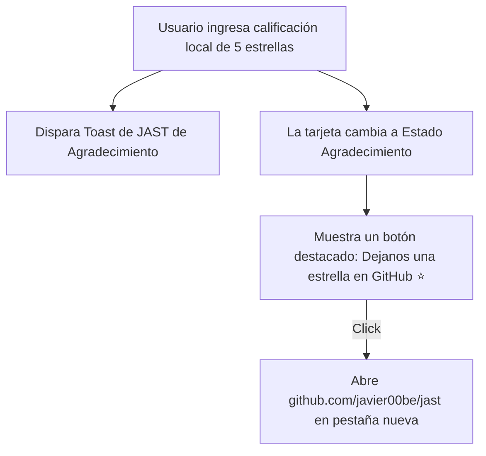

# Propuesta: Integración de la API de GitHub e Invitación a Dar Estrella (JAST)

Esta propuesta detalla el diseño técnico para conectar el Playground de **JAST** con la API REST pública de GitHub, permitiendo mostrar el conteo real de estrellas del repositorio y animar a los usuarios a dar "Star" de forma nativa.

---

## 1. Objetivos del Cambio

- **Conexión Dinámica con GitHub**: Consumir el endpoint público de GitHub `https://api.github.com/repos/javier00be/jast` para obtener en tiempo real la cantidad oficial de estrellas (`stargazers_count`).
- **Visualización Dinámica**: Reflejar este conteo dinámico en:
  1. El Trust Badge del Hero (reemplazando el promedio estático 4.9/5).
  2. La tarjeta de valoración del sidebar de Docs.
- **Acción de Conversión Directa (Call to Action)**: Si el usuario otorga una puntuación alta (4 o 5 estrellas) en nuestro componente interactivo local, la tarjeta mostrará un botón llamativo e interactivo: _« ¡Dejanos una estrella en GitHub! ⭐ »_ que abrirá el repositorio en una pestaña nueva para que vote nativamente.

---

## 2. Decisiones de Arquitectura Técnica

### A. Consumo de API mediante Native `fetch`

- Para evitar agregar imports pesados y configuraciones complejas de `HttpClient` en `app.config.ts` y en el árbol de dependencias, utilizaremos el estándar nativo de los navegadores **`window.fetch`** dentro del componente `SidebarRatingComponent` y `HeroComponent`.
- Esto mantiene las clases livianas, modulares y con cero sobrecosto de bundles.
- Caching de cortesía: Guardaremos el número de estrellas en un Signal compartible o consultado de forma rápida para no sobrepasar el límite de peticiones (rate limiting) de la API pública de GitHub.

### B. Flujo de Experiencia de Usuario (UX) al Votar:

---

## 3. Archivos Involucrados

1. `projects/playground/src/app/layout/sidebar-rating/sidebar-rating.ts`:
   - Realizar la petición `fetch` a la API de GitHub en `ngOnInit`.
   - Modificar el template del estado de agradecimiento para mostrar el botón de redirección de estrella de GitHub.
2. `projects/playground/src/app/sections/hero/hero.ts`:
   - Realizar la petición `fetch` en su inicialización para extraer las estrellas de GitHub.
   - Reflejar la cantidad real dinámicamente en el badge.

---

## 4. Riesgos y Mitigación

- **Riesgo**: Límite de peticiones de la API pública de GitHub (60 peticiones por hora por IP para clientes no autenticados).
  - _Mitigación_: Si la petición de `fetch` falla (ej. por rate limiting o si el usuario no tiene conexión), aplicaremos un **fallback elegante por defecto** mostrando _« +0 estrellas »_ o un texto genérico de confianza, evitando que la interfaz se rompa.
