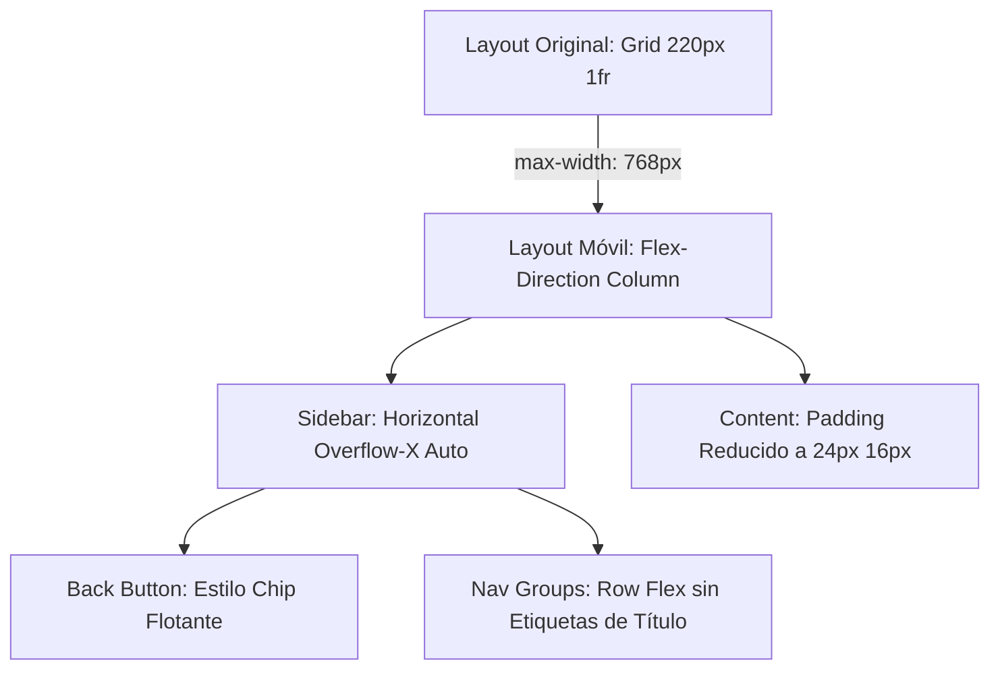

# Diseño Técnico: Playground Responsive para Móvil (JAST)

Este documento describe la arquitectura técnica de estilos, selectores y las soluciones CSS aplicadas para lograr la adaptabilidad móvil sin alterar la semántica HTML ni la funcionalidad Angular.

---

## 1. Diseño de Arquitectura del Menú Superior de Documentación (`docs-page.ts`)

En móviles (`max-width: 768px`), el sidebar vertical se convertirá en un **menú superior horizontal deslizable**.



### Solución Técnica CSS para la Documentación:
```css
@media (max-width: 768px) {
  .docs-layout {
    display: flex;
    flex-direction: column;
    grid-template-columns: 1fr;
  }
  .sidebar {
    position: static;
    height: auto;
    border-right: none;
    border-bottom: 1px solid var(--border);
    padding: 16px;
    flex-direction: row;
    align-items: center;
    overflow-x: auto;
    gap: 16px;
    white-space: nowrap;
    /* Ocultar barra de scroll en Firefox y navegadores Webkit */
    scrollbar-width: none;
    -webkit-overflow-scrolling: touch;
    &::-webkit-scrollbar {
      display: none;
    }
  }
  .back {
    padding: 6px 12px;
    background: var(--surface-2);
    border-radius: 8px;
    display: inline-flex;
    align-items: center;
  }
  .nav-group {
    flex-direction: row;
    align-items: center;
    gap: 8px;
  }
  .nav-label {
    display: none; /* Ocultamos los títulos pesados */
  }
  .content {
    padding: 24px 16px;
    max-width: 100%;
  }
}
```

---

## 2. Conversión Semántica de Tablas a Tarjetas (`api-ref.ts` & `styling.ts`)

Para evitar reescribir las tablas en HTML, usaremos remapeo de visualización por CSS Grid/Flex en pantallas chicas (`max-width: 600px`).

### Estructura de Clases Reutilizada:
```css
@media (max-width: 600px) {
  /* 1. Ocultar cabeceras tabulares */
  .method-header,
  .prop-header {
    display: none !important;
  }

  /* 2. Quitar fondo rígido de tabla */
  .method-table,
  .prop-table {
    border: none !important;
    background: transparent !important;
  }

  /* 3. Transformar cada fila en una tarjeta vertical */
  .method-row,
  .prop-row,
  .styles-row {
    grid-template-columns: 1fr !important;
    display: flex !important;
    flex-direction: column !important;
    align-items: flex-start !important;
    gap: 8px !important;
    padding: 16px !important;
    background: var(--surface) !important;
    border: 1px solid var(--border) !important;
    border-radius: 12px !important;
    margin-bottom: 12px !important;
  }

  /* 4. Resaltar nombres de métodos o propiedades */
  .method-name,
  .prop-name {
    font-size: 14px !important;
    font-weight: 700 !important;
    color: var(--accent) !important;
    border-bottom: 1px solid var(--border);
    padding-bottom: 4px !important;
    width: 100%;
  }

  /* 5. Inyectar etiquetas de contexto semántico usando Pseudo-elementos */
  .method-param::before {
    content: 'Parámetro: ' !important;
    font-weight: 600 !important;
    color: var(--text-secondary) !important;
    opacity: 0.7;
  }
  
  .prop-type::before {
    content: 'Tipo: ' !important;
    font-weight: 600 !important;
    color: var(--text-secondary) !important;
    opacity: 0.7;
  }

  .prop-default::before {
    content: 'Default: ' !important;
    font-weight: 600 !important;
    color: var(--text-secondary) !important;
    opacity: 0.7;
  }

  .var-default::before {
    content: 'Default: ' !important;
    font-weight: 600 !important;
    color: var(--text-secondary) !important;
    opacity: 0.7;
  }

  /* 6. Alinear descripción */
  .method-desc,
  .prop-desc,
  .var-desc {
    margin-top: 4px;
    font-size: 13px !important;
    color: var(--text-secondary) !important;
    line-height: 1.5 !important;
  }
}
```

---

## 3. Adaptabilidad del Playground (`demo.ts`)

Para la demo interactiva, colapsaremos la pantalla del simulador a ancho completo bajo `968px`.

```css
@media (max-width: 968px) {
  .cols {
    grid-template-columns: 1fr !important;
    gap: 40px !important;
  }
  .left {
    gap: 16px !important;
  }
  .right {
    justify-content: center !important;
    margin-top: 0 !important;
    width: 100% !important;
  }
  .screen {
    aspect-ratio: auto !important;
    min-height: 280px !important;
    width: 100% !important;
    padding: 16px !important;
  }
  .type-row {
    justify-content: center !important;
  }
  .extras {
    width: 100% !important;
  }
}
```

---

## 4. Optimizaciones en Navbar y Footer (`navbar.ts` / `footer.ts`)

- **Navbar**: Reducción de ancho en celular y ocultamiento selectivo del texto secundario del logo.
```css
@media (max-width: 768px) {
  nav {
    padding: 0 16px !important;
  }
  .logo-sub {
    display: none !important;
  }
  .links {
    gap: 16px !important;
  }
}
@media (max-width: 480px) {
  .github-btn span {
    display: none !important; /* Muestra solo el icono de GitHub */
  }
  .github-btn {
    padding: 6px !important;
    border-radius: 50% !important;
  }
}
```

- **Footer**: Centrado de enlaces y texto.
```css
@media (max-width: 600px) {
  .inner {
    flex-direction: column !important;
    gap: 16px !important;
    text-align: center !important;
  }
}
```

---

## 5. Decisiones de Diseño Técnico Premium (SOLID)
- **CSS Encapsulado**: Las reglas responsivas se mantendrán encapsuladas dentro de la directiva `@Component.styles` de cada archivo TS. Esto respeta la arquitectura stand-alone de Angular y evita contaminar el archivo global `styles.scss` con selectores innecesarios.
- **Sin Dependencias**: Todo el comportamiento se resuelve con CSS estándar nativo de los navegadores actuales, lo cual reduce tiempos de renderizado y el bundle size final del Playground.
