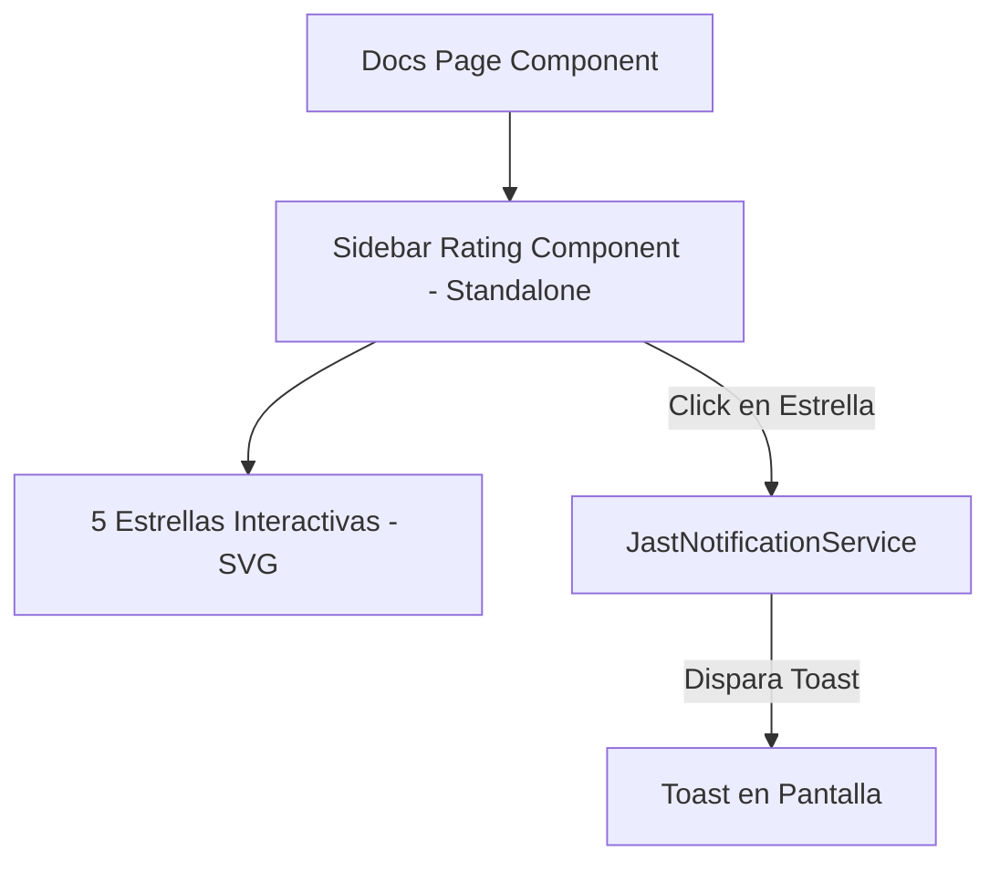

# Propuesta: Componente de Valoración con Estrellas e Indicador en Hero (JAST)

Esta propuesta describe el plan técnico para diseñar e implementar un sistema de valoración interactivo en el Playground de **JAST**, integrando un indicador de confianza en el Hero y una tarjeta interactiva con estrellas en el sidebar de la documentación.

---

## 1. Objetivos del Cambio

- **Confianza en el Hero**: Añadir un indicador visual discreto y elegante debajo de los botones principales del Hero que muestre una calificación promedio ficticia pero atractiva de la comunidad.
- **Interactividad en Docs**: Implementar una tarjeta flotante en la parte inferior del menú lateral de la documentación con 5 estrellas interactivas.
- **Demostración de la Librería**: Al seleccionar una calificación, se disparará una notificación toast animada de la librería `jast-notification` agradeciendo el feedback de manera reactiva.

---

## 2. Arquitectura de Componentes

Proponemos la creación de un nuevo componente standalone de Angular para encapsular el comportamiento del votador:

### Archivos Nuevos e Involucrados:

1. `projects/playground/src/app/layout/sidebar-rating/sidebar-rating.ts` (NUEVO COMPONENT): Encapsula la lógica de hover, selección de estrellas, persistencia local (para no votar dos veces) y disparo del Toast.
2. `projects/playground/src/app/pages/docs/docs-page.ts`: Importa y renderiza el componente al final del sidebar.
3. `projects/playground/src/app/sections/hero/hero.ts`: Agrega el badge visual de confianza debajo de los botones principales.

---

## 3. Estrategia de Solución Técnica

### A. Indicador de Confianza en el Hero (`hero.ts`)

- Añadir un elemento `
` debajo del contenedor `.ctas`.
- Estilo: Texto pequeño en `var(--text-secondary)`, una estrella dorada brillante con micro-animación de pulso, y un diseño adaptado responsivo que se centre en móviles.

### B. Componente de Valoración (`sidebar-rating.ts`)

- **Visual**: Una tarjeta elegante (`.rating-card`) con bordes suaves, fondo sutil `var(--surface-2)`, y 5 estrellas SVG.
- **Hover Dinámico**: Al pasar el cursor por encima, las estrellas se pintan de dorado de forma acumulativa (si pasás sobre la 3, se pintan la 1, 2 y 3).
- **Persistencia en LocalStorage**: Si el usuario ya votó, recordaremos su voto y cambiaremos la tarjeta a un estado de agradecimiento permanente para no saturar con múltiples envíos.
- **Responsividad**: El componente fluirá horizontalmente o se adaptará al menú superior colapsable de móviles sin desbordar.

---

## 4. Plan de Cierre y Pruebas

- Verificar que el componente compile perfectamente.
- Correr la suite de pruebas unitarias para descartar regresiones.
- Guardar el estado en `state.yaml` de la carpeta `openspec/changes/star-rating-component/`.
